# Quantitative Comparison under Disturbances

We compare the proposed GVF-based method with the Fast Planner and its recoverable variant under disturbance conditions.

---

## Fast Planner

  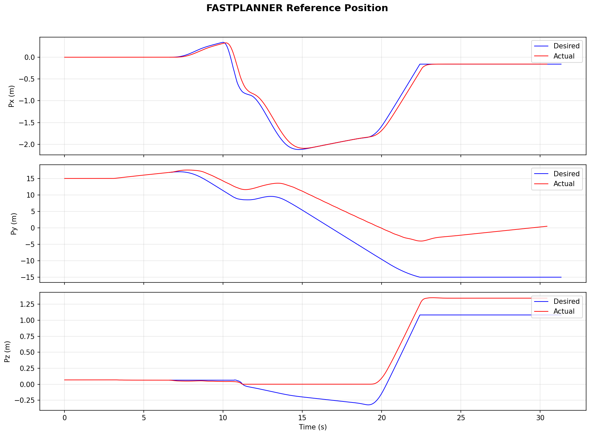
  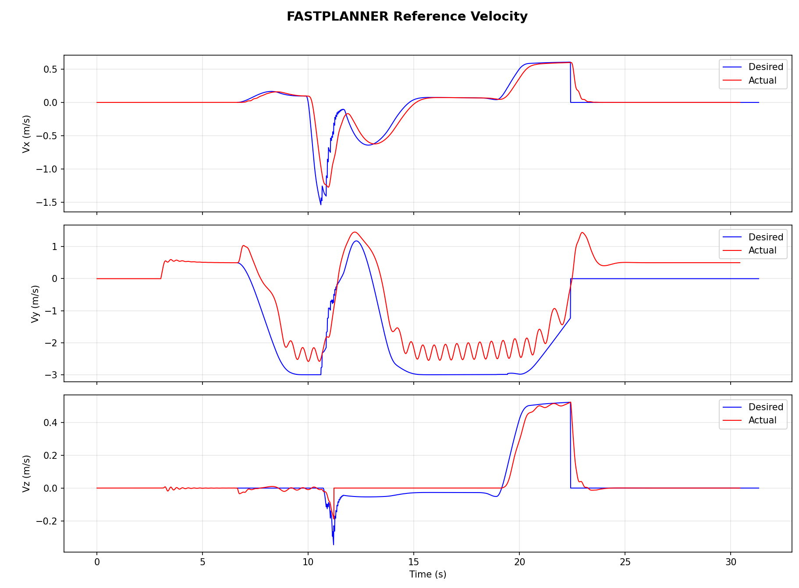
  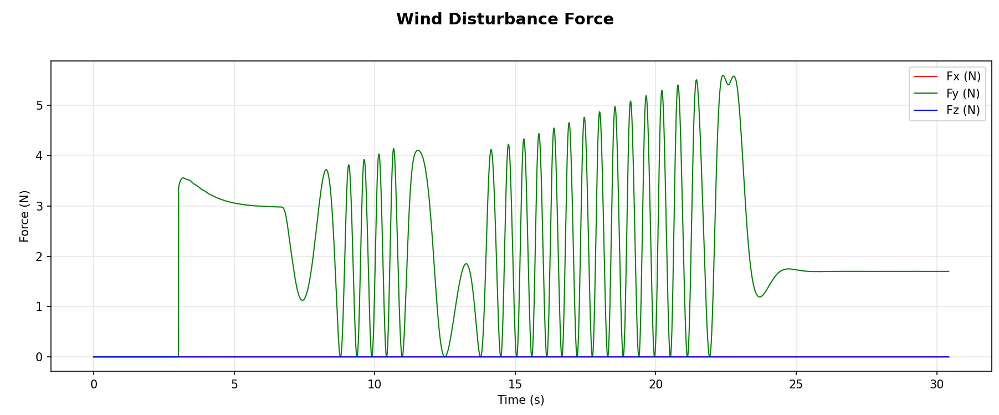

F1: Position tracking performance of the Fast-Planner under disturbance.

F2: Velocity profile of Fast-Planner under disturbance. Taking the Y-axis velocity in the time interval from 15s to 20s as an example, the actual velocity of the quadrotor exhibits fluctuations due to wind disturbances, while the reference velocity does not provide corresponding compensation. This leads to a gradual accumulation of tracking error and eventually results in navigation failure.

F3: Wind disturbance profile experienced by Fast-Planner during flight, where the disturbance follows a sinusoidal pattern.

  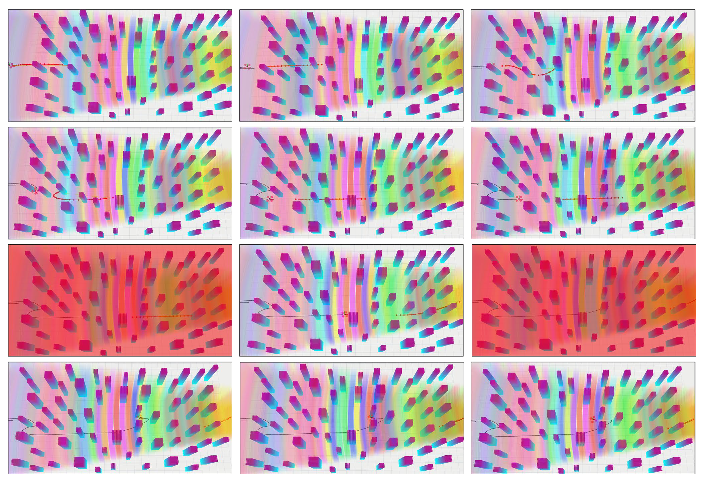
  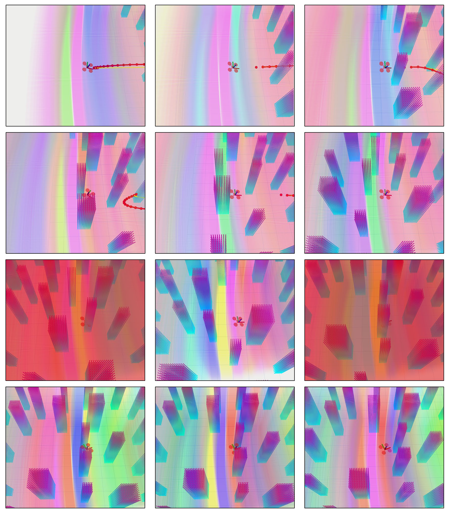

F4: Performance of Fast-Planner under wind disturbances. Due to the presence of wind, this open-loop strategy gradually exhibits a delay with the reference trajectory. The moments highlighted in red correspond to collision events.

F5: Local zoom-in view of Fast-Planner under wind disturbances.

The original Fast Planner exhibits significant trajectory deviation and lacks effective recovery under disturbances.

---

## Fast Planner (Recoverable)

  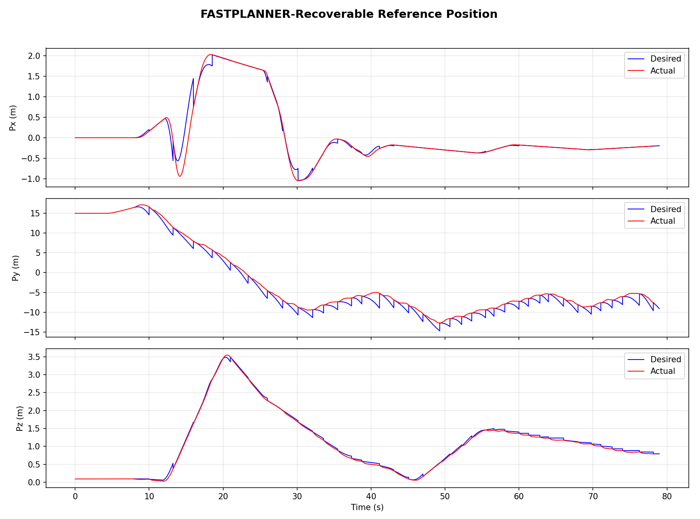
  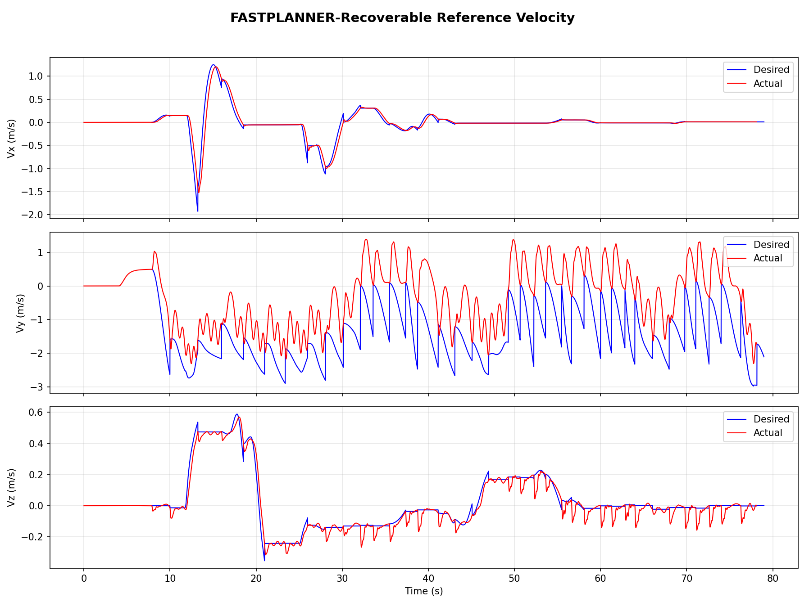
  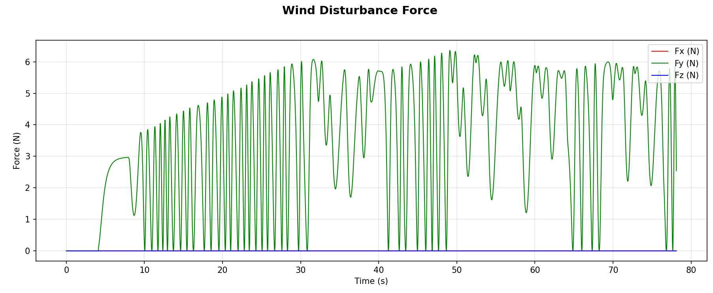

F6: Position tracking performance of Fast-Planner with a recovery mechanism under disturbances. Taking the Y-axis curve as an example, although the tracking performance appears improved due to frequent replanning from the current position, the reference position is repeatedly corrected based on the current state, which prevents the quadrotor from actually reaching the target point.

F7: Velocity profile of Fast-Planner with a recovery mechanism under disturbances. Taking the Y-axis velocity in the time interval from 30s to 40s as an example, after introducing the recovery mechanism, replanning is initialized from the current state (position and velocity). Due to wind disturbances, the velocity is nearly zero, which leads to a near-zero initial velocity for replanning. Consequently, the velocity control loop gain becomes ineffective and the quadrotor cannot accelerate. In this case, replanning is triggered frequently while the system remains nearly stationary, corresponding to the previously mentioned Zeno-like behavior.

F8: Wind disturbance profile experienced by Fast-Planner with a recovery mechanism during flight.

  
  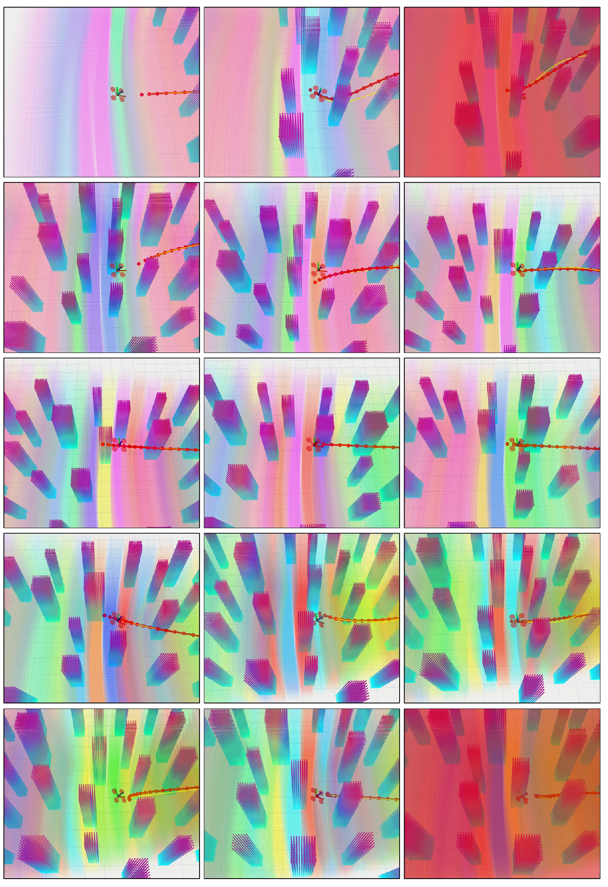

F9: Performance of Fast-Planner with a recovery mechanism under wind disturbances. The recovery mechanism triggers replanning from the current quadrotor state when the deviation between the reference point and the actual position exceeds a threshold. However, since no explicit disturbance-rejection reference term is incorporated, the system may exhibit stagnation as wind disturbances gradually increase. The moments highlighted in red correspond to collision events.

F10: Local zoom-in view of Fast-Planner with a recovery mechanism under wind disturbances.

The recoverable Fast Planner improves disturbance handling but still suffers from discontinuities and delayed recovery.

---

## GVF (Proposed Method)

  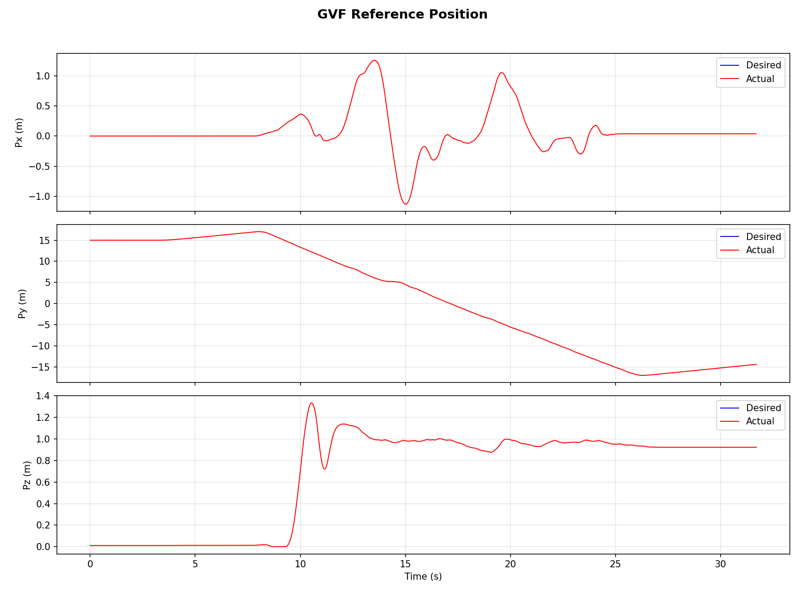
  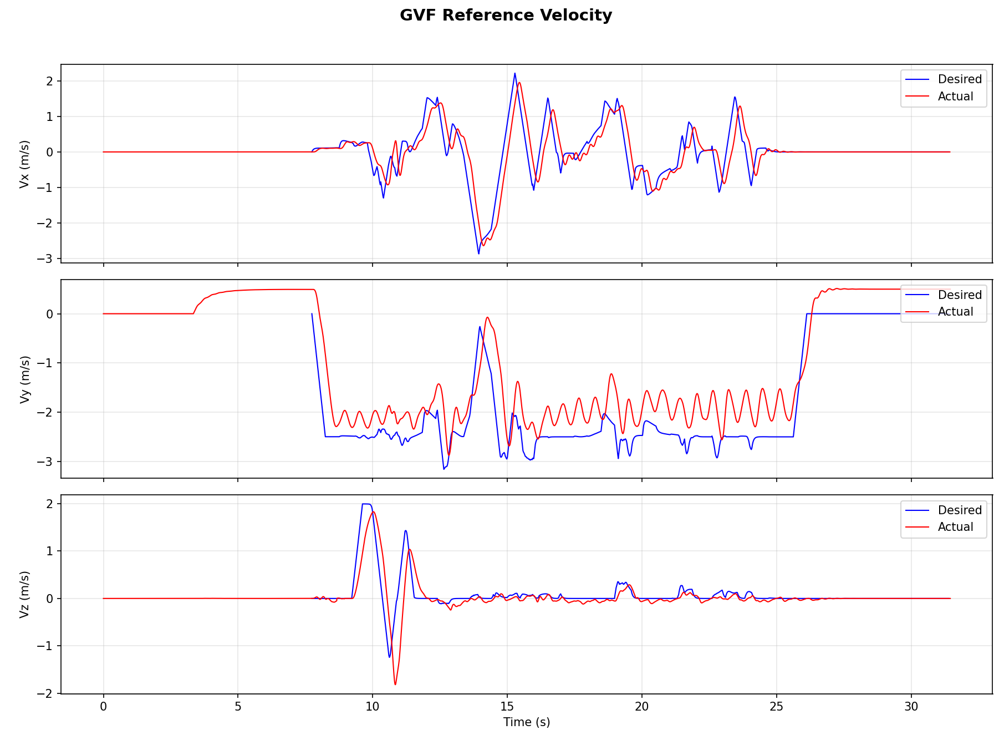
  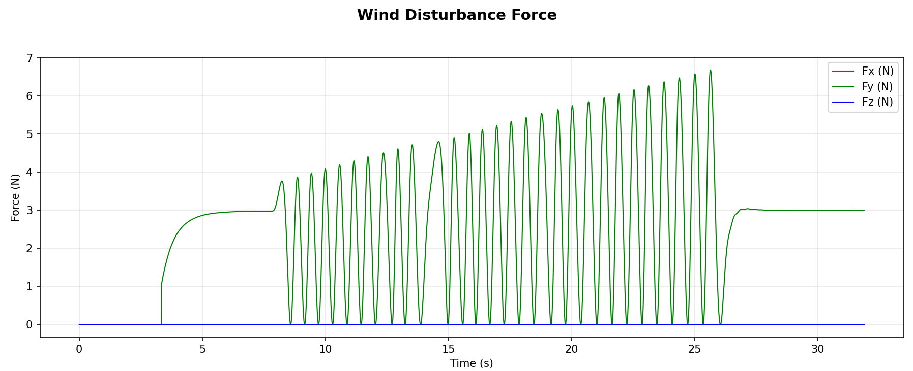

F11: Position response of GVF. Since GVF computes the reference velocity directly from the current state, no reference position trajectory is defined. It can be observed that the quadrotor motion is smooth, indicating that the control commands generated by the proposed GVF method satisfy the requirements for smooth motion.

F12: Velocity profile of GVF under disturbances. Taking the Y-axis velocity in the time interval from 15s to 20s as an example, the GVF method introduces velocity compensation. Although the actual velocity does not fully track the reference velocity, this compensation keeps the quadrotor close to the reference path. The reference is defined only by the geometric path skeleton rather than time-varying points, so strict tracking is not required. This property leads to significantly stronger disturbance rejection compared to other methods.

F13: Wind disturbances experienced by GVF during flight.

  
  

F14: Performance of the proposed GVF method under wind disturbances. The GVF explicitly incorporates a disturbance-rejection mechanism, enabling the quadrotor to avoid all obstacles and successfully reach the target point.

F15: Local zoom-in view of GVF under wind disturbances.

The proposed GVF-based method achieves smooth and continuous trajectory adaptation, demonstrating superior robustness under disturbances.

---

## Summary

Compared with both Fast Planner and its recoverable variant, the GVF-based method provides continuous feedback-driven navigation, avoids abrupt replanning behavior, and enables faster and smoother recovery under disturbances.
